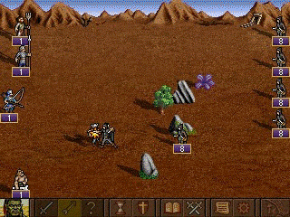

# Pocket Palm Heroes [](https://discord.gg/Rw95NQx)

This project tries to bring good old Palm Heroes/Pocket Heroes back to life. The work was started in 2017.



## Running from sources

To run the game, clone the repo and execute the following command:

```
./gradlew runJvm      # for Linux/Mac
.\gradlew.bat runJvm  # for Windows
```

Java needs to be installed on the computer.

## What we have

### Sources of different versions

Unsurprisingly, this project is based on the following source codes:

1. <https://github.com/sigman78/pocketheroes/> (available under Apache 2.0 license) &mdash; 1.04 beta. Can't be compiled
   because
   of `Before proceeding, ensure you have: * Visual-studio compiler with WinMobile support * WTL library installed`.
1. <https://sourceforge.net/projects/palmheroes/> (available under Apache 2.0 license) &mdash; seems to be 1.03. Can't
   be compiled because of lack of some files. Also, there is many code that is related to licence registration (take a
   look at commits).

The sources are old (not the latest 1.05). Let's primarily use the 1.04 beta version.

### Change logs

Change logs are needed to fix the old sources and upgrade the version to the final known one &mdash; 1.05.

* [0.02, 0.03, 0.041](http://hpc.ru/soft/software.phtml?id=9712).
* [1.01, 1.03](http://hpc.ru/soft/software.phtml?id=18685).
* [1.04, 1.05](https://4pda.ru/forum/index.php?showtopic=104972).

### File prefixes
Many source files has prefixes.

Prefix|Possible description
---|---
gxl|Main framework
xxl|Extensions for the main framework
xau|Audio compression
xjp|Image compression
he|"Helium" library

### Game menus

Menu classes|Description|Menu items
---|---|---
`MenuView`/`iMainMenuDlg`|Main menu screen|`TRID_MENU_NEWGAME`, `TRID_MENU_LOADGAME`, `TRID_MENU_HIGHSCORE`, `TRID_MENU_CREDITS`, `TRID_MENU_EXITGAME`
`GameMenuDlg`/`iGameMenuDlg`|Small menu dialog in the corner of the screen during the game|Settings, Save game, Main menu, Quit, Return to game

## What we do

Port the existing sources to Kotlin. Use [KorGE](https://korge.org/) (available under Apache 2.0 license) to draw
picture, process user input, and provide binaries for different platforms.

### Progress

The progress can be seen under the [Issues](https://github.com/anonymous-frog-studio/pph/issues) tab.

There are some screencasts of what's working:

* [Progress bar](https://youtu.be/gDINi7vj29k).
* [Main menu](https://youtu.be/jZVkJDCNsCQ).

### Practices

There are some practices of rewriting C++ code to JVM-related code.

#### Constant references

Many objects are passed to functions as constants. To archive this in Kotlin, it's needed to write an interface with
constant (read-only) methods and another interface or class with other methods that extends/implements the constant
interface. The interface should have the "I" prefix (from "Immutable"). You can find many examples in the ported
sources.

Maybe Kotlin will have such a concept in the future: [KT-44173](https://youtrack.jetbrains.com/issue/KT-44173).

#### Pointers

Some arguments are passed as pointers and are modified inside the function. For these purposes, just pass mutable
object. If the type is immutable, for example, `String` or `Int`, we have a special wrapper called `Mutable<T>`. Find
examples in the ported sources.

#### Remove super classes

* `iIListNode`.
* `TypeAware`.

#### Use standard Kotlin classes

Kotlin class|Initial type
---|---
`String`|`_T("String content")`, `L"String content"`, `LPCTSTR`, `iStringTemplate<E>`, `iStringW`, `iStringA`, `iStringT`
`Byte`|`sint8`
`UByte`|`uint8`
`Short`|`sint16`
`UShort`|`uint16`
`Int`|`sint32`
`UInt`|`uint32`
`Long`|`sint64`
`ULong`|`uint64`

#### Code folding

IDEs such as IDEA or NetBeans can fold code. It's useful to hide huge pieces of code by default:

```html
//<editor-fold defaultstate="collapsed" desc="hashCode & equals">
custom hashCode and equals methods here
//</editor-fold>
``` 

## Other links

* Pocket Heroes aka Palm Heroes history &mdash; <http://wiki.ioupg.com/doku.php/ioupgteam:pocket_heroes>. Has some info
  about the game resources compression. Interesting in general ;)
* Group with fans of Palm Kingdoms, the descendant game &mdash; <https://vk.com/palmkingdoms>.
* Previous repo of this porting effort &mdash; <https://github.com/anonymous-frog-studio/new-ph-legacy> &mdash; obsolete
  and archived.

## License

This work is available under Apache 2.0 license.
